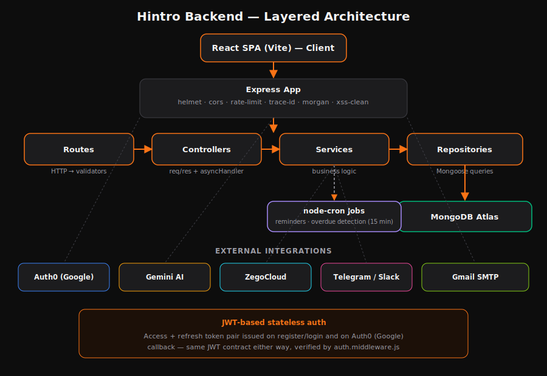
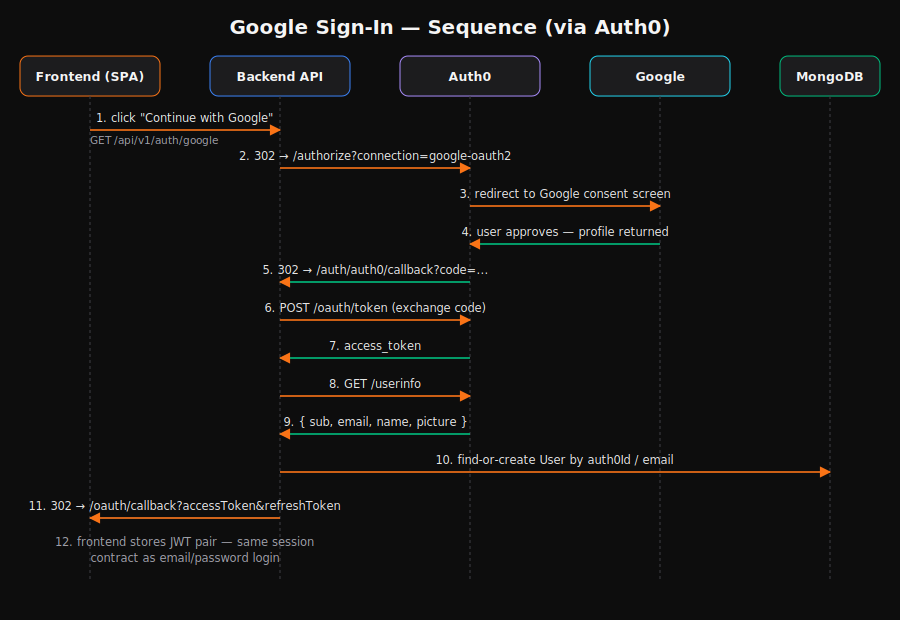

# Hintro Backend API

AI-powered Meeting Intelligence Platform — Node.js · Express · MongoDB · Gemini AI.

Hintro transcribes, summarizes, and extracts decisions and action items from meetings automatically, with citation-backed AI insights, automated reminders, and a stateless JWT auth layer that supports both email/password and Google (via Auth0) sign-in.

**Live API:** https://hintro-backend-lv7t.onrender.com
**Live app (frontend):** https://hintro-fronend-b2iz.vercel.app/

## Architecture (LLD)

<table>
  <tr>
    <td width="50%"></td>
    <td width="50%"></td>
  </tr>
  <tr>
    <td align="center"><sub>System architecture — layered request pipeline + external integrations</sub></td>
    <td align="center"><sub>Google sign-in sequence — Auth0-brokered OAuth2 code flow</sub></td>
  </tr>
</table>

Each feature module in `src/api/v1/<module>/` follows the same layering: **routes → controller → service → repository → model**. Controllers stay thin (parse request, call service, shape response); services hold business logic; repositories are the only layer that talks to Mongoose.

## Tech Stack

| Layer | Technology |
|---|---|
| Runtime | Node.js ≥20, Express 4 |
| Database | MongoDB + Mongoose |
| Auth | JWT (access + refresh), bcrypt, Auth0 (Google social login) |
| AI | Gemini (default) / OpenAI — provider-agnostic via `ai.factory.js` |
| Validation | Joi |
| Jobs | node-cron (meeting reminders, overdue detection — every 15 min) |
| Integrations | ZegoCloud (video), Telegram, Slack, Gmail SMTP |
| Logging | Winston + daily rotating file transport |
| Docs | Swagger / OpenAPI (`/api-docs`) |
| Testing | Jest + Supertest + mongodb-memory-server |

## Quick Start

```bash
cp .env.example .env   # fill in your values
npm install
npm run dev            # starts on http://localhost:5000
```

API docs: http://localhost:5000/api-docs
Health check: http://localhost:5000/health

## Environment Variables

| Variable | Required | Description |
|---|---|---|
| `PORT` | No | Default `5000` |
| `APP_URL` | No | This server's own public URL (used to build default callback URLs) |
| `CLIENT_URL` | No | Frontend origin — used for CORS and post-login redirects |
| `MONGODB_URI` | Yes | MongoDB connection string |
| `JWT_SECRET` / `JWT_REFRESH_SECRET` | Yes | Min 32 chars each |
| `BCRYPT_ROUNDS` | No | Default `12` |
| `AI_PROVIDER` | No | `gemini` or `openai` |
| `GEMINI_API_KEY` / `OPENAI_API_KEY` | Depends on provider | AI provider key |
| `AUTH0_DOMAIN` | For Google login | e.g. `your-tenant.us.auth0.com` |
| `AUTH0_CLIENT_ID` / `AUTH0_CLIENT_SECRET` | For Google login | From your Auth0 Application |
| `AUTH0_CALLBACK_URL` | For Google login | Must also be added to Auth0's Allowed Callback URLs |
| `TELEGRAM_BOT_TOKEN` | No | For Telegram reminders |
| `SLACK_BOT_TOKEN` / `SLACK_SIGNING_SECRET` | No | For Slack reminders |
| `ZEGO_APP_ID` / `ZEGO_SERVER_SECRET` | For video meetings | From ZegoCloud console |
| `EMAIL_USER` / `EMAIL_APP_PASSWORD` | No | Gmail SMTP for email notifications |

Full list with defaults: [`.env.example`](.env.example).

## API Endpoints

### Auth (`/api/v1/auth`)
| Method | Path | Description |
|---|---|---|
| POST | `/register` | Register new user |
| POST | `/login` | Login |
| GET | `/google` | Start Google sign-in (redirects via Auth0) |
| GET | `/auth0/callback` | Auth0 OAuth callback — issues JWT pair |
| POST | `/refresh` | Refresh access token |
| POST | `/logout` | Logout |
| GET | `/me` | Current user profile |
| PATCH | `/change-password` | Change password |
| PATCH | `/preferences` | Update notification preferences / integrations |

### Meetings (`/api/v1/meetings`)
| Method | Path | Description |
|---|---|---|
| GET | `/` | List meetings (paginated, filterable) |
| POST | `/` | Create meeting |
| GET | `/:id` | Get meeting by ID |
| PATCH | `/:id` | Update meeting |
| DELETE | `/:id` | Delete meeting |
| POST | `/:id/analyze` | Full AI analysis (summary + actions + insights) |
| GET | `/:id/room-info` | Video room metadata |
| POST | `/:id/token` | Generate ZegoCloud room token |

### Transcripts (`/api/v1/transcripts`)
| Method | Path | Description |
|---|---|---|
| POST | `/:meetingId` | Upload/replace transcript |
| GET | `/:meetingId` | Get transcript |
| DELETE | `/:meetingId` | Delete transcript |

### Action Items (`/api/v1/action-items`)
| Method | Path | Description |
|---|---|---|
| GET | `/overdue` | All overdue items |
| GET | `/` | List (filter by status/meetingId/assignee) |
| POST | `/` | Create action item |
| PATCH | `/:id/status` | Update status |

### AI Analysis (`/api/v1/ai`)
| Method | Path | Description |
|---|---|---|
| POST | `/meetings/:meetingId/summarize` | Generate summary |
| POST | `/meetings/:meetingId/extract-actions` | Extract action items |
| POST | `/meetings/:meetingId/insights` | Generate insights |
| POST | `/meetings/:meetingId/analyze` | Run all three |

### Notifications (`/api/v1/notifications`)
| Method | Path | Description |
|---|---|---|
| GET | `/` | List notifications |
| PATCH | `/:id/read` | Mark as read |
| PATCH | `/read-all` | Mark all as read |

### System
| Method | Path | Description |
|---|---|---|
| GET | `/health` | Health check |
| GET | `/api/v1/evaluation` | Platform metrics |
| GET | `/api-docs` | Swagger UI |

## Running Tests

```bash
npm test                 # all tests
npm run test:unit        # unit tests only
npm run test:integration # integration tests only
npm run test:coverage    # with coverage report
```

## Cron Jobs

| Job | Schedule | Description |
|---|---|---|
| Meeting Reminders | Every 15 min | Sends reminders for upcoming meetings |
| Overdue Detection | Every 15 min | Flags overdue action items + Telegram alerts |

## Project Structure

```
src/
├── api/v1/              # Feature modules (controller/service/repository/validator/routes)
│   ├── auth/             # register/login/refresh + Google (Auth0) OAuth
│   ├── meetings/
│   ├── transcripts/
│   ├── action-items/
│   ├── ai/
│   ├── notifications/
│   └── evaluation/
├── config/               # App / auth / AI / OAuth / Swagger configuration
├── integrations/         # AI factory, Telegram, Slack, email clients
├── jobs/                 # node-cron scheduled jobs
├── middleware/           # auth, error, rate limiter, trace ID, validate
├── models/                # Mongoose schemas
└── utils/                # ApiError, ApiResponse, asyncHandler, logger, pagination
```

## Deployment

Deployed as a standard long-running Node process (Render, Railway, Fly.io, etc. — anything that supports background `node-cron` jobs, unlike serverless platforms). Required for a new environment:

1. All environment variables above, with production values (`CLIENT_URL` → your deployed frontend origin, `AUTH0_CALLBACK_URL` → your deployed backend origin)
2. MongoDB Atlas Network Access must allow the host's outbound IPs (or `0.0.0.0/0` for simplicity on non-static-IP platforms)
3. Auth0 Dashboard → Application → Allowed Callback URLs must include the production `AUTH0_CALLBACK_URL`
